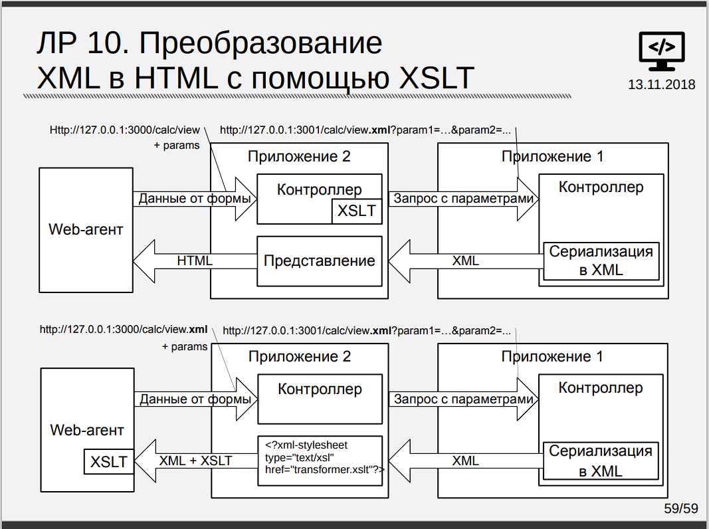

# Запуск склонированного репозитория

```shell
rake app:update:bin
```

# API (Приложение 1)



## Создание проекта

Создаем API, задачей которого является формирование XML и передача в неизменном виде приложению №2 (Proxy).

```shell
rails new twins-api
rails generate controller TwinsApi view
```

**TwinsApi** является контроллером, который обрабатывает входные данные, и задача которого, просто генерировать их.

## Редактирование кода ЛР8 для наших нужд

В контроллере, делаем все то же самое, что и в ЛР 8, только меняем формирование html документа на
xml [twins-api/app/controllers/twins_api_controller.rb](twins-api%2Fapp%2Fcontrollers%2Ftwins_api_controller.rb) (в моем случае в
функции `to_table`).

Было:

```ruby

def to_table(pairs = @result, table_class = 'table')
  @table = 'Unknown!'

  unless pairs.empty?
    rows = ''
    pairs.each do |key, value|
      rows += "<tr><td>#{key}</td><td>#{value}</td></tr>"
    end
    @table = "<table class=\"#{table_class}\"><tbody>#{rows}</tbody></table>"
  end

  @table
end
```

Стало:

```ruby

def to_table(pairs = @result)
  # Создание xml таблицы

  @table = 'Unknown!'

  unless pairs.empty?
    rows = ''
    pairs.each do |key, value|
      rows += "<cd><id>#{key}</id><item>#{value}</item></cd>"
    end
    @table = "<catalog>#{rows}</catalog>"
  end

  @table
end
```

Как мы видим, мы просто заменили `tbody` на `catalog`, `tr` на `cd`, и каждый из `td` на `id` и `item` в соответствии
с [twins-proxy/public/some_transformer.xslt](twins-proxy%2Fpublic%2Fsome_transformer.xslt), см [XSLT](#XSLT)

> Не работайте (иногда)! В файле *twins-api/app/config/routes.rb* добавляем дефолтный путь до отображения
> результата `root 'twins_api#view'` - [twins-api/app/config/routes.rb](twins-api%2Fconfig%2Froutes.rb)

А также во `view.html.erb` добавляем `<span> <%= @table %> </span>` для того, чтобы получить результат выполнения при
использовании **get** запроса на html страничку.

Создадим там же файл [twins-api/app/views/twins_api/view.xml.erb](twins-api%2Fapp%2Fviews%2Ftwins_api%2Fview.xml.erb), чтобы можно было получать
данные в xml формате.

## Why api?

Данное приложение называется API, так как выдает результат на основе входных данных.

# Proxy (Приложение 2)

## Создание проекта

Создаем Proxy, задачей которого является передача запроса серверу с **API**, последующее получение результатов вычисления в
формте **XML** и дальнейшее преобразование полученной строки с помощью `xslt` в `html`, а также отображение результатов в
браузере.

```shell
rails new twins-proxy
rails generate controller TwinsProxy input view
```

- input - форма формирования запроса
- view - форма отображения результата

## XSLT

Создаем файл **some_transformer.xslt** ([twins-proxy/public/some_transformer.xslt](twins-proxy%2Fpublic%2Fsome_transformer.xslt)) для преобразования
xml в html и кладем в папку public. Он представляет собой таблицу, для которой изменены названия столбцов, рядов и ее
названия. Для теста преобразования создаем там же **test_xslt.rb** ([twins-proxy/test_xslt.rb](twins-proxy%2Ftest_xslt.rb)), а *
*some_file.xml** ([twins-proxy/some_file.xml](twins-proxy%2Fsome_file.xml)) нужен для теста **test_xslt.rb**, кладем из в корневую
директорию проекта.

## Создание страниц

Можно использовать html страницы из ЛР8. Для этого, просто скопируем их в *twins/app/view/twins_proxy*. Изменится:

- header, к примеру с `<h1>Twins#input</h1>` на `<h1>TwinsProxy#input</h1>`
- путь в теге `form` в input с `action="/twins/view"` на `action="/twins_proxy/view"`
- кнопка возврата во **view** с `<%= link_to "Рассчитать заново", :twins_input %>`
  на `<%= link_to "Рассчитать заново", :twins_proxy_input %>`, т.к. было добавлено слово proxy.

> Не работает (иногда)! Также, добавим в *app/config/routes.rb* путь по умолчанию на
> ввод (`root 'twins_proxy#input'`) - [twins-proxy/config/routes.rb](twins-proxy%2Fconfig%2Froutes.rb)

## Контроллер

Напишем контроллер таким образом, чтобы он конвертировал полученный от API сервера результат с помощью xslt в html и
отображал его во view [twins-proxy/app/controllers/twins_proxy_controller.rb](twins-proxy%2Fapp%2Fcontrollers%2Ftwins_proxy_controller.rb). Для
получения результатов от сервера используем gem `http`. Функция преобразования называется `xslt_transform`, а создание
запроса - `make_query`, в качестве параметра укажите свое название, например `value`, у меня это `n`.

Базовый пример:

```ruby
require 'net/http'
require 'nokogiri'

class TwinsProxyController < ApplicationController
  BASE_API_URL = 'http://127.0.0.1:3000/twins_api/view' # Путь до файла с возможность преобразования
  XSLT_SERVER_TRANSFORM = "#{Rails.root}/some_transformer.xslt" # Путь до xslt файла

  def input; end

  def view
    responce = make_query BASE_API_URL

    respond_to do |format|
      format.html do
        @output = xslt_transform(responce).to_html
        render 'view'
      end
    end
  end

  def make_query(server_url)
    # server_url - URL для получения ответа от приложения 1 (API)

    query_str = "#{server_url}"
    query_str << "?n=#{@input}" if (@input = params[:n]&.split(' ')&.join('+'))

    uri = URI(query_str)

    pp 'query_str:', query_str

    res = Net::HTTP.get_response(uri)

    # Форматируем html вывод
    str1_markerstring = '<span>' # маркер начала xml
    str2_markerstring = '</span>' # маркер конца xml

    output = res.body[/#{str1_markerstring}(.*?)#{str2_markerstring}/m, 1]
    output.gsub('&lt;', '<').gsub('&gt;', '>')
  end

  def xslt_transform(data, transform: XSLT_SERVER_TRANSFORM)
    # Функция преобразования

    print data, transform, "\n"

    doc = Nokogiri::XML(data)
    xslt = Nokogiri::XSLT(File.read(transform))
    xslt.transform(doc)
  end
end

```

Запускаем тестовую сборку через 2 консоли:

```shell
сd twins-api
rails s

сd twins-proxy
rails s -p 3001
```

## XML и XML+XSLT на сервере

Для того, чтобы выдавать результат в виде XML и XML + XSLT на серверной стороне добавим 2 кнопки для этого, 2-ая из
которых перенапрявляет на чисты XML. Создадим [twins-proxy/app/views/twins_proxy/view.xml.erb](twins-proxy%2Fapp%2Fviews%2Ftwins_proxy%2Fview.xml.erb).

Отредактируем констроллер, добавив рендер XML:

```ruby

def view
  print 'Params:', params, "\n"

  responce = make_query BASE_API_URL, '.xml'

  respond_to do |format|
    format.html do
      print 'Render HTML ', params[:commit], "\n"

      @output = xslt_transform(responce).to_html
    end

    format.xml do
      print 'Render XML ', params[:commit], "\n"

      @output = insert_browser_xslt(responce).to_xml
    end
  end
end
```

Форма для отображения двух вариантов страниц будет выглядеть так:
> Note: `name` и `value` добавлять не обязательно, это для тестов
> Также, `action` будет выбираться в зависимости от нажатой кнопки см. [Подключим js](#настраиваем-клиентскую-часть)

```html

<form action="" method="get" id="calc_form" accept-charset="UTF-8" data-remote="false">
    <label for="n">
        <input type="number" id="n" name="n" min="0" minlength="1" oninput="this.value = Math.abs(this.value);"
               required/>
    </label>
    <input id="xslt" name="commit" type="submit" value="XML+XSLT"/>
    <input id="xml" name="commit" type="submit" value="XML"/>
</form>
```

## Преобразование XML в HTML на клиенте

Добавим селекторы для выбора обработчкика (сервер/клиент)
во [view.html.erb](twins-proxy%2Fapp%2Fviews%2Ftwins_proxy%2Fview.html.erb)

```html

<div>
    <input type="radio" id="server_radio" name="selector" checked/>
    <label for="server_radio">Серверный обработчик</label>

    <input type="radio" id="client_radio" name="selector"/>
    <label for="client_radio">Клиентский обработчки</label>
</div>
```

### Подключим js

Остановим сервер.
В `Gemfile`:

```ruby
gem 'jquery-rails'
```

В консоли:

```shell
bundle install
```

В [app/config/initializers/assets.rb](twins-proxy%2Fconfig%2Finitializers%2Fassets.rb):

```ruby
Rails.application.config.assets.precompile += %w( jquery.min.js jquery_ujs.js )
```

В [app/config/importmap.rb](twins-proxy%2Fconfig%2Fimportmap.rb):

```ruby
pin_all_from 'app/javascript/src', under: 'src'
pin "jquery", to: "jquery.min.js", preload: true
pin "jquery_ujs", to: "jquery_ujs.js", preload: true
```

Создадим папку src для js с обработчиком клиентской
части [twins-proxy/app/javascript/src/client_converter.js](twins-proxy%2Fapp%2Fjavascript%2Fsrc%2Fclient_converter.js).

В [app/javascript/application.js](twins-proxy%2Fapp%2Fjavascript%2Fapplication.js):

```ruby
import "jquery"
import "jquery_ujs"
import "src/client_converter"
```

### Настраиваем клиентскую часть

Установим запрет кэширования в [twins-proxy/config/environments/development.rb](twins-proxy%2Fconfig%2Fenvironments%2Fdevelopment.rb) и
application.rb[application.rb](twins-proxy%2Fconfig%2Fapplication.rb)

```shell
config.public_file_server.headers = {
      'Cache-Control' => 'no-cache'
    }
    config.action_view.preload_links_header = false
```

В [twins-proxy/app/javascript/src/client_converter.js](twins-proxy%2Fapp%2Fjavascript%2Fsrc%2Fclient_converter.js) добавим слушатель нажатий кнопко для
изменнения `action` формы:

```js
// Меняем action в зависимости от нажатой кнопки
$(document).on("click", 'input[id="xslt"]', function () {
    $("#calc_form").attr('action', '/twins_proxy/view.html');
});

$(document).on("click", 'input[id="xml"]', function () {
    $("#calc_form").attr('action', '/twins_proxy/view.xml');
});
```

Добавим в [twins-proxy/app/views/twins_proxy/input.html.erb](twins-proxy%2Fapp%2Fviews%2Ftwins_proxy%2Finput.html.erb) тег для вывода результатов:

```html

<div id="result"></div>
```

Добавляем обаботку на стороне клиента (`xslt_transform` и `insert_browser_xslt` уже включают XSLT transformer). Чтобы не
заморачиваться с проверкой входных данных используем питонячий формат написания кода через `try/catch`.

```js
function client_side_process(data) {
    console.log('client_side_process', data);
    const result = document.getElementById("result");
    let str = '';

    try {
        str = new XMLSerializer().serializeToString(data.documentElement);
    } catch (e) {
        str = data;
    }

    result.innerHTML = "<hr/>Результат: " + str +
        "<hr/><p id='date'>" + Date() + "</p>";
}
```

### Настриваем одновременную работу клиента и сервера

В связи с [Багом 1](#баг-1), было принято решение применить ящерские технолологии по сохранению состояния сайта и его
восстановлению при перезагрузке. Для этого, уберем `checked`
селектора `<input type="radio" id="server_radio" name="selector" value="1" />` [input.html.erb](twins-proxy%2Fapp%2Fviews%2Ftwins_proxy%2Finput.html.erb).

После чего переработаем `js` [client_converter.js](twins-proxy%2Fapp%2Fjavascript%2Fsrc%2Fclient_converter.js), добавив
сохранение и восстановление состояний.

```js
// Сохраняем состояние приложения
function saveState(_state = null) {
    let server_radio = $("input:radio[id=server_radio]:checked").val();
    let n = document.getElementById("n").value;

    let state = '';
    if (!server_radio) {
        state = '0';
    } else {
        state = '1'
    }

    if (_state) {
        state = _state;
    }

    localStorage.setItem('server_radio', state);
    localStorage.setItem('input', n);

    console.log('State saved', state, n)
}

// Получаем состояние приложения
function getState() {
    return localStorage.getItem('server_radio');
}

// Восстанавливаем состояние приложения
function restoreState() {
    setFormDataRemote();
    setCheckboxState();
    setInputVal();
}


// Устанавливаем параметр `data-remote` для формы
function setFormDataRemote() {
    let calc_form = $('#calc_form');
    let state = getState();
    console.log('data-remote before:', calc_form.attr('data-remote'));

    if (state === '1') {
        console.log('Radio server');
        $(calc_form).attr('data-remote', false);
    } else {
        console.log('Radio client');
        $(calc_form).attr('data-remote', true);
    }

    console.log('data-remote after:', calc_form.attr('data-remote'));
}

// Устанавливаем состояние активного чекбокса
function setCheckboxState() {
    let state = getState();

    if (state === '1') {
        $("#server_radio").attr('checked', true)
    } else {
        $("#client_radio").attr('checked', true)
    }
}

// Задаем значение поля ввода из локального хранилища
function setInputVal() {
    document.getElementById("n").value = localStorage.getItem('input');
}

// Сохраняем состояние приложения по-умолчанию
function setDefaultState(state = '1') {
    let localState = getState();

    if (!localState) {
        saveState(state); // устанавливаем чекбокс на сервер, если не стоит по умолчанию
    }
}

// Перезагружаем страницу в случае смена чекбокса для сброса кэша
$(document).on("change", 'input[type="radio"]', function () {
    saveState();
    setFormDataRemote();

    // Костыль
    location.reload();
});
```

`state` по факту отвечает за то, активен ли чекбокс сервера или нет.

## Тест 1

Добавим в Gemfile `gem 'rails-controller-testing'` для того, чтобы избежать ошибок Rails.

Напишем функциональный тест, проверяющий что при различных входных данных результат генерируемой страницы различен. Для
этого перейдем в папку *test/controllers/<ВАШЕ НАЗВАНИЕ>
_test.rb* ([twins-proxy/test/controllers/twins_proxy_controller_test.rb](twins-proxy%2Ftest%2Fcontrollers%2Ftwins_proxy_controller_test.rb))

```ruby
test 'check different result' do
  get twins_proxy_view_url, params: { n: 3 }
  result1 = assigns[:output]

  get twins_proxy_view_url, params: { n: 10 }
  result2 = assigns[:output]

  assert_not_same result1, result2
end
```

Где `:output` - instance переменная `@output` контроллера `TwinsProxyController`

Запускаем в консоли при рабочем API, но выключенном Proxy (может потребоваться запустить тест 2 раза чтобы очистить кэш)

```shell
...twins-proxy> rake test
```

## Тест 2

Проверить, что браузер получает XML первого приложения в неизменном виде.

Редактируем все тот же
файл [twins-proxy/test/controllers/twins_proxy_controller_test.rb](twins-proxy%2Ftest%2Fcontrollers%2Ftwins_proxy_controller_test.rb)

```ruby
test 'we check that the XML is unchanged' do
  query_str = "#{BASE_API_URL}.xml"
  query_str << '?n=10'
  uri = URI(query_str)
  res = Net::HTTP.get_response(uri)

  target = "<?xml version=\"1.0\" encoding=\"UTF-8\"?>
<output>
    &lt;catalog&gt;&lt;cd&gt;&lt;id&gt;11&lt;/id&gt;&lt;item&gt;13&lt;/item&gt;&lt;/cd&gt;&lt;cd&gt;&lt;id&gt;17&lt;/id&gt;&lt;item&gt;19&lt;/item&gt;&lt;/cd&gt;&lt;/catalog&gt;
</output>\n"

  assert_equal target, res.body
end
```

## Тест 3

Проверить, что браузер производит преобразование XML->HTML в соответствии с xlt. Не указано, что нужно делать тест, да и
это нериально, так что просто смотрим, что все ок.

## Тест 4

Реализовать функциональные тесты второго приложения. Проверить результаты, формируемые приложением, на соответствие
выбранному формату
выдачи. [twins-proxy/test/controllers/twins_proxy_controller_test.rb](twins-proxy%2Ftest%2Fcontrollers%2Ftwins_proxy_controller_test.rb)

```ruby
test 'check html proxy result' do
  get twins_proxy_view_url, params: { n: 3 }
  result = assigns[:output]
  target = "<table border=\"1\">\n<tr bgcolor=\"#9933ff\">\n<th>1</th>\n<th>2</th>\n</tr>\n<tr>\n<td>3</td>\n<td>5</td>\n</tr>\n</table>\n"
  assert_equal result, target
end

test 'check xml proxy result' do
  get "#{twins_proxy_view_url}.xml", params: { n: 3 }
  target = "<?xml version=\"1.0\"?>\n<?xml-stylesheet type=\"text/xsl\" href=\"C:/Users/neizvestnyj/Desktop/BMSTU/Semestr_3/IPL/LW/LW10/Project/twins-proxy/public/some_transformer.xslt\"?>\n<catalog>\n  <cd>\n    <id>3</id>\n    <item>5</item>\n  </cd>\n</catalog>\n"

  assert_equal assigns[:output], target
end
```

## RSS тест

Добавим в контролеер [twins_proxy_controller.rb](twins-proxy%2Fapp%2Fcontrollers%2Ftwins_proxy_controller.rb)

```ruby
format.rss { render xml: insert_browser_xslt(responce).to_xml }
```

Тесты:
```ruby
test 'check rss' do
  get "#{twins_proxy_view_url}.rss", params: { n: 3 }
  target = "<?xml version=\"1.0\"?>\n<?xml-stylesheet type=\"text/xsl\" href=\"C:/Users/neizvestnyj/Desktop/BMSTU/Semestr_3/IPL/LW/LW10/Project/twins-proxy/public/some_transformer.xslt\"?>\n<catalog>\n  <cd>\n    <id>3</id>\n    <item>5</item>\n  </cd>\n</catalog>\n"

  assert_equal @response.body.clone, target
end

test 'should get different responds for different rss requests' do
  get "#{twins_proxy_view_url}.rss", params: { n: 3 }
  response1 = @response.body.clone

  get "#{twins_proxy_view_url}.rss", params: { n: 10 }
  response2 = @response.body.clone

  assert_not_equal response1, response2
end
```

### Баг 1

Код выше отлично работает (без `location.reload`), значит ajax слушается успешно и изменения вступают в силу. Чтобы
выбрать между клиентом и сервером, я меняю флаги `data-remote` в `form` в зависимости от места обработки. Если мы
сначала выбрали обработку на стороне сервера, то она будет отрабатывать, пока не сменим на клиент, и тогда ничего не
произойдет, аналогично для клиента, он будет отрабатывать, но после смены на сервер все равно продолжит это делать. При
этом view изменяется корректно

```js
$(document).on("change", 'input[type="radio"]', function () {
    let calc_form = $('#calc_form');
    console.log('data-remote before:', calc_form.attr('data-remote'));

    if ($(this).val() === '1') {
        console.log('Radio server');
        $(calc_form).attr('data-remote', false);
    } else {
        console.log('Radio client');
        $(calc_form).attr('data-remote', true);
    }

    console.log('data-remote after:', calc_form.attr('data-remote'));
});
```

## Итог по Proxy

### Должны получить в итоге файлы:
#### Proxy:
- [twins-proxy/test_xslt.rb](twins-proxy%2Ftest_xslt.rb) - автономаная Ruby программа для теста преобразования xml в html
- [twins-proxy/some_file.xml](twins-proxy%2Fsome_file.xml) - тестовый .xml файл для **test_xslt.rb**
- [twins-proxy/public/some_transformer.xslt](twins-proxy%2Fpublic%2Fsome_transformer.xslt) - XSLT-программа для преобразования xml в html
- [twins-proxy/app/views/proxy_view/view.xml.erb](twins-proxy%2Fapp%2Fviews%2Ftwins_proxy%2Fview.xml.erb) - xml страница
- [twins-proxy/app/javascript/src/client_converter.js](twins-proxy%2Fapp%2Fjavascript%2Fsrc%2Fclient_converter.js) - javaScript
- [twins-proxy/config/routes.rb](twins-proxy%2Fconfig%2Froutes.rb) - маршруты
- [Gemfile](twins-proxy%2FGemfile) - либы

#### Api:
- [twins-api/app/views/twins_api/view.xml.erb](twins-api%2Fapp%2Fviews%2Ftwins_api%2Fview.xml.erb) - xml страница

### И отредактировать:
#### Proxy:
- [twins-proxy/app/views/proxy_view/input.html.erb](twins-proxy%2Fapp%2Fviews%2Ftwins_proxy%2Finput.html.erb) - ввод
- [twins-proxy/app/views/proxy_view/view.html.erb](twins-proxy%2Fapp%2Fviews%2Ftwins_proxy%2Fview.html.erb) - вывод
- [twins-proxy/app/controllers/twins_proxy_controller.rb](twins-proxy%2Fapp%2Fcontrollers%2Ftwins_proxy_controller.rb) - контроллер
- [app/config/importmap.rb](twins-proxy%2Fconfig%2Fimportmap.rb) - импорт js
- [app/config/initializers/assets.rb](twins-proxy%2Fconfig%2Finitializers%2Fassets.rb) - компиляция js
- [twins-proxy/test/controllers/twins_proxy_controller_test.rb](twins-proxy%2Ftest%2Fcontrollers%2Ftwins_proxy_controller_test.rb) - тесты
  
#### Api:
- [twins-api/app/controllers/twins_api_controller.rb](twins-api%2Fapp%2Fcontrollers%2Ftwins_api_controller.rb)
